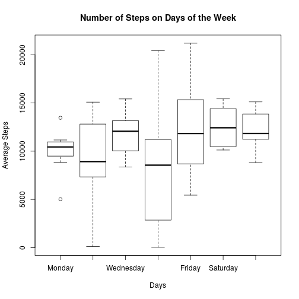
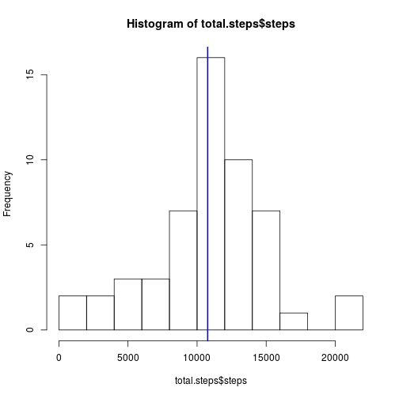
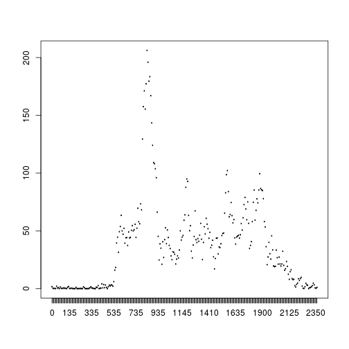
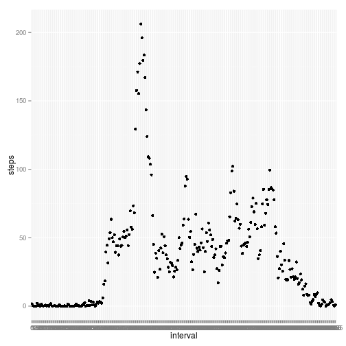
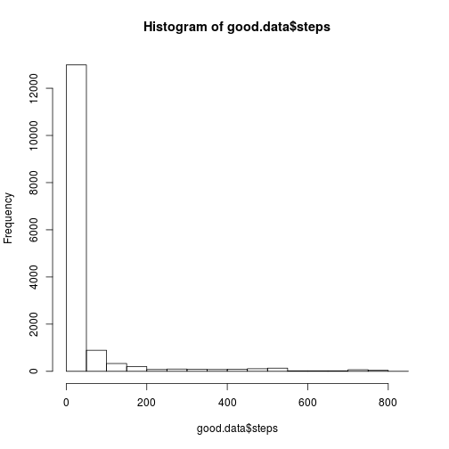
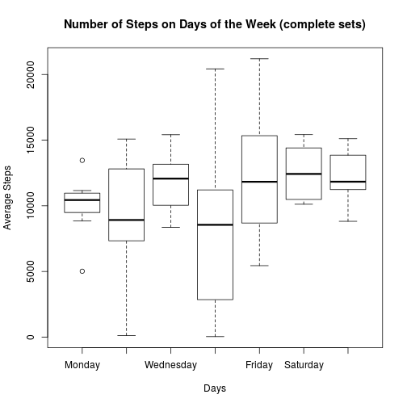
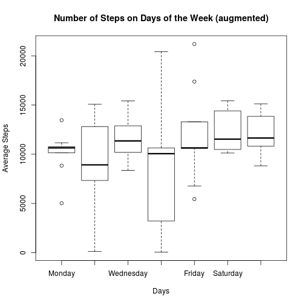
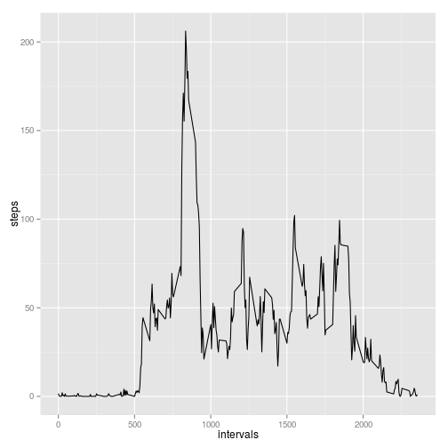
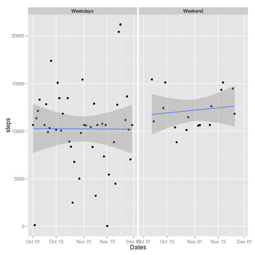
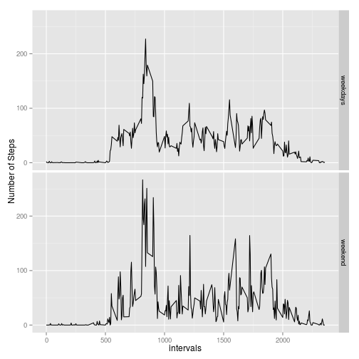

## Loading and preprocessing the data

1. The data is downloaded from the url into the _./data_ directory.
2. The name of the zip file is _repdata_activity.zip_
3. The data is extracted from the zip file directly
4. After the data frame is available, it is examined with the _str()_ function


```r
get.the.file <- function() {
    fileUrl <- "https://d396qusza40orc.cloudfront.net/repdata%2Fdata%2Factivity.zip"
    datapath <- file.path("./data/repdata_activity.zip")
    data.filepath = "activity.csv"

    if (!dir.exists(dirname(datapath)))
        dir.create(dirname(datapath))

    if (!file.exists(datapath))
        download.file(fileUrl,destfile=datapath,method="curl")
    else
        print(paste("file already exists:",datapath))
    my.data <- read.csv(unz(datapath,data.filepath))

    return(my.data)
}

the.data <- get.the.file()
```

```
## [1] "file already exists: ./data/repdata_activity.zip"
```

```r
str(the.data)
```

```
## 'data.frame':	17568 obs. of  3 variables:
##  $ steps   : int  NA NA NA NA NA NA NA NA NA NA ...
##  $ date    : Factor w/ 61 levels "2012-10-01","2012-10-02",..: 1 1 1 1 1 1 1 1 1 1 ...
##  $ interval: int  0 5 10 15 20 25 30 35 40 45 ...
```

### Data Cleaning

1. Only complete sets are kept, so observations having _NA_ in them, are filtered out.
2. _date_ is converted to factor


```r
good.filter <- complete.cases(the.data)
##dim(the.data)
good.data <- the.data[good.filter,]
good.data$date = factor(good.data$date)
str(good.data)
```

```
## 'data.frame':	15264 obs. of  3 variables:
##  $ steps   : int  0 0 0 0 0 0 0 0 0 0 ...
##  $ date    : Factor w/ 53 levels "2012-10-02","2012-10-03",..: 1 1 1 1 1 1 1 1 1 1 ...
##  $ interval: int  0 5 10 15 20 25 30 35 40 45 ...
```

## What is mean total number of steps taken per day?

1. Only _date_ and _steps_ columns are used.
2. Steps are summed up for each _date_ factor (using _melt_ and _caust_ functions from _reshape_ package)
3. _Dates_ column is added, where _date_ values are converted into _Date_ type
4. A _weekday_ column is added with the name of the day for each date (weekday is converted into factors)


```r
get.day.sums <- function(good.data) {
    ##install.packages("reshape")
    library(reshape)
    steps.frame = data.frame(good.data$date,good.data$steps)
    names(steps.frame) = c("date","steps")
    total.steps <- cast(melt(steps.frame),date ~ variable, sum)
   
    total.steps$Dates = as.Date(levels(total.steps$date))
    the.days <- c("Monday","Tuesday","Wednesday","Thursday","Friday","Saturday","Sunday") 
    total.steps$weekday = factor(weekdays(total.steps$Dates),levels=the.days,ordered=T)

    return(total.steps)
}

total.steps <- get.day.sums(good.data)
```

```
## Using date as id variables
```

```r
##str(total.steps)
mt <- mean(total.steps$steps)
md <- median(total.steps$steps)
print(paste("mean of steps:",mt))
```

```
## [1] "mean of steps: 10766.1886792453"
```

```r
print(paste("median of steps:",md))
```

```
## [1] "median of steps: 10765"
```

### Mean and Median

As it can be seen from the code, the mean of steps is 1.0766189 &times; 10<sup>4</sup> and the meadian is 10765.

#### In Plot

Two views are shown here:

1. Average steps per days of the week
2. Histogram for average steps


```r
plot(total.steps$weekday,total.steps$steps,main="Number of Steps on Days of the Week",xlab="Days",ylab="Average Steps",type = "l")
```

 

```r
hist(total.steps$steps,breaks=10)
abline(v = mt, col = "blue", lwd = 2)
```

 

## What is the average daily activity pattern?

1. _steps_ and _interval_ are used
2. _interval_ is transformed to factor
3. _intervals_ stores the averages by interval types


```r
get.interval.means <- function(good.data) {
    interval.frame <- data.frame(good.data$steps,good.data$interval)
    names(interval.frame) = c("steps","interval")
    interval.frame$interval = factor(interval.frame$interval,ordered=T)
    interval.means <- cast(melt(interval.frame),interval ~ variable, mean)
    interval.means$intervals = as.numeric(levels(interval.means$interval))

    return(interval.means)
}

interval.means <- get.interval.means(good.data)
```

```
## Using interval as id variables
```

```r
str(interval.means)
```

```
## List of 3
##  $ interval : Ord.factor w/ 288 levels "0"<"5"<"10"<"15"<..: 1 2 3 4 5 6 7 8 9 10 ...
##  $ steps    : num [1:288] 1.717 0.3396 0.1321 0.1509 0.0755 ...
##  $ intervals: num [1:288] 0 5 10 15 20 25 30 35 40 45 ...
##  - attr(*, "row.names")= int [1:288] 1 2 3 4 5 6 7 8 9 10 ...
##  - attr(*, "idvars")= chr "interval"
##  - attr(*, "rdimnames")=List of 2
##   ..$ :'data.frame':	288 obs. of  1 variable:
##   .. ..$ interval: Ord.factor w/ 288 levels "0"<"5"<"10"<"15"<..: 1 2 3 4 5 6 7 8 9 10 ...
##   ..$ :'data.frame':	1 obs. of  1 variable:
##   .. ..$ variable: Factor w/ 1 level "steps": 1
```

The same data is plotted three different ways:

1. basic plot
2. quick plot
3. ggplot2


```r
plot(interval.means$interval,interval.means$steps,type = "l")
```

 

```r
library(ggplot2)
qplot(interval,steps,data=interval.means)
```

 

```r
g2 <- ggplot(interval.means,aes(intervals,steps))
q2 <- g2 + geom_line()
print(q2)
```

 

```r
max.steps.index <- which.max(interval.means$steps)
max.steps <- max(interval.means$steps)
interval_of_max_steps <- interval.means[max.steps.index,]$intervals
```

### Maximum Steps

Maximum number of average steps: 206.1698113.

Maximum number of average steps belongs to the following interval: 835.

## Imputing missing values

a. Missing values are drawn from the previous data.frame.
b. Each observation is processed in a loop.


```r
augment.data <- function(the.data,interval.means) {
    for (i in 1:nrow(the.data)) {
        if (is.na(the.data$steps[i]))
            the.data$steps[i] = as.integer(interval.means$steps[interval.means$interval==the.data$interval[i]])
    }
    return(the.data)
}

missing.vals <- sum(is.na(the.data$steps))
```

The number of missing values imputed: 2304.

The two histograms are shown below each other: the one with only complete datasets and the one with NA values replaced by averages.


```r
aug.data <- the.data
aug.data <- augment.data(aug.data,interval.means)
str(aug.data)
```

```
## 'data.frame':	17568 obs. of  3 variables:
##  $ steps   : int  1 0 0 0 0 2 0 0 0 1 ...
##  $ date    : Factor w/ 61 levels "2012-10-01","2012-10-02",..: 1 1 1 1 1 1 1 1 1 1 ...
##  $ interval: int  0 5 10 15 20 25 30 35 40 45 ...
```

```r
str(the.data)
```

```
## 'data.frame':	17568 obs. of  3 variables:
##  $ steps   : int  NA NA NA NA NA NA NA NA NA NA ...
##  $ date    : Factor w/ 61 levels "2012-10-01","2012-10-02",..: 1 1 1 1 1 1 1 1 1 1 ...
##  $ interval: int  0 5 10 15 20 25 30 35 40 45 ...
```

```r
hist(good.data$steps)                   # more than 12000
```

 

```r
hist(aug.data$steps)                    # a little less than 15000
```

 

The totals for each day are also calculated and shown. For comparison, the plot from above is also shown.


```r
aug.totals <- get.day.sums(aug.data)
```

```
## Using date as id variables
```

```r
str(aug.totals)
```

```
## List of 4
##  $ date   : Factor w/ 61 levels "2012-10-01","2012-10-02",..: 1 2 3 4 5 6 7 8 9 10 ...
##  $ steps  : int [1:61] 10641 126 11352 12116 13294 15420 11015 10641 12811 9900 ...
##  $ Dates  : Date[1:61], format: "2012-10-01" "2012-10-02" ...
##  $ weekday: Ord.factor w/ 7 levels "Monday"<"Tuesday"<..: 1 2 3 4 5 6 7 1 2 3 ...
##  - attr(*, "row.names")= int [1:61] 1 2 3 4 5 6 7 8 9 10 ...
##  - attr(*, "idvars")= chr "date"
##  - attr(*, "rdimnames")=List of 2
##   ..$ :'data.frame':	61 obs. of  1 variable:
##   .. ..$ date: Factor w/ 61 levels "2012-10-01","2012-10-02",..: 1 2 3 4 5 6 7 8 9 10 ...
##   ..$ :'data.frame':	1 obs. of  1 variable:
##   .. ..$ variable: Factor w/ 1 level "steps": 1
```

```r
plot(total.steps$weekday,total.steps$steps,main="Number of Steps on Days of the Week (complete sets)",xlab="Days",ylab="Average Steps")
```

 

```r
plot(aug.totals$weekday,aug.totals$steps,main="Number of Steps on Days of the Week (augmented)",xlab="Days",ylab="Average Steps")
```

 

```r
mt1 <- mean(aug.totals$steps)
md1 <- median(aug.totals$steps)
print(paste("mean of steps:",mt1))
```

```
## [1] "mean of steps: 10749.7704918033"
```

```r
print(paste("median of steps:",md1))
```

```
## [1] "median of steps: 10641"
```

```r
aug.intervals <- get.interval.means(aug.data)
```

```
## Using interval as id variables
```

```r
g3 <- ggplot(aug.intervals,aes(intervals,steps))
q3 <- g3 + geom_line()
print(q3)
```

 

## Are there differences in activity patterns between weekdays and weekends?

### An Interesting Digression

Here, an intentional deviation was made from the original task because that one did not show such a difference as the one below, which shows clearly that everage steps at the weekend are higher and as December is nearning, it is slightly rising, whereas weekday stepnumber seems to be the same average, even if the values are more wildly scattered.


```r
weekend <- c("Saturday","Sunday")
aug.totals$isWeekend = as.numeric(weekdays(aug.totals$Dates) %in% weekend)
aug.totals$isWeekend = factor(aug.totals$isWeekend)
levels(aug.totals$isWeekend) = c("Weekdays","Weekend")
str(aug.totals)
```

```
## List of 5
##  $ date     : Factor w/ 61 levels "2012-10-01","2012-10-02",..: 1 2 3 4 5 6 7 8 9 10 ...
##  $ steps    : int [1:61] 10641 126 11352 12116 13294 15420 11015 10641 12811 9900 ...
##  $ Dates    : Date[1:61], format: "2012-10-01" "2012-10-02" ...
##  $ weekday  : Ord.factor w/ 7 levels "Monday"<"Tuesday"<..: 1 2 3 4 5 6 7 1 2 3 ...
##  $ isWeekend: Factor w/ 2 levels "Weekdays","Weekend": 1 1 1 1 1 2 2 1 1 1 ...
##  - attr(*, "row.names")= int [1:61] 1 2 3 4 5 6 7 8 9 10 ...
##  - attr(*, "idvars")= chr "date"
##  - attr(*, "rdimnames")=List of 2
##   ..$ :'data.frame':	61 obs. of  1 variable:
##   .. ..$ date: Factor w/ 61 levels "2012-10-01","2012-10-02",..: 1 2 3 4 5 6 7 8 9 10 ...
##   ..$ :'data.frame':	1 obs. of  1 variable:
##   .. ..$ variable: Factor w/ 1 level "steps": 1
```

```r
g4 <- ggplot(aug.totals,aes(Dates,steps))
p4 <- g4 + geom_point() + facet_grid(. ~ isWeekend) + geom_smooth(method = "lm")
print(p4)
```

 

### The Original Task

But of course the original task can also be plotted.

1. Starting from aug.data (augmented data), the same preparations are done as from filtered out data.
2. The means are calculated for weekends and weekdays
3. The two types of data are unified and plotted


```r
## data preparation
aug.data$Dates = as.Date(levels(aug.data$date))
the.days <- c("Monday","Tuesday","Wednesday","Thursday","Friday","Saturday","Sunday")
aug.data$weekday = factor(weekdays(aug.data$Dates),levels=the.days,ordered=T)
aug.data$isWeekend = as.numeric(weekdays(aug.data$Dates) %in% weekend)
levels(aug.data$isWeekend) = c("Weekdays","Weekend")

## means are calculated
weekday.data <- aug.data[aug.data$isWeekend==0,]
weekend.data <- aug.data[aug.data$isWeekend==1,]
weekday.interval.means <- get.interval.means(weekday.data)
```

```
## Using interval as id variables
```

```r
weekend.interval.means <- get.interval.means(weekend.data)
```

```
## Using interval as id variables
```

```r
weekday.interval.means$isWeekend = "weekdays"
weekend.interval.means$isWeekend = "weekend"

# unification and factorisation
interval.means2 <- rbind(weekday.interval.means,weekend.interval.means)
interval.means2$isWeekend = factor(interval.means2$isWeekend)
str(interval.means2)
```

```
## List of 4
##  $ interval : Ord.factor w/ 288 levels "0"<"5"<"10"<"15"<..: 1 2 3 4 5 6 7 8 9 10 ...
##  $ steps    : num [1:576] 2.2 0.4 0.1556 0.1778 0.0889 ...
##  $ intervals: num [1:576] 0 5 10 15 20 25 30 35 40 45 ...
##  $ isWeekend: Factor w/ 2 levels "weekdays","weekend": 1 1 1 1 1 1 1 1 1 1 ...
##  - attr(*, "row.names")= int [1:576] 1 2 3 4 5 6 7 8 9 10 ...
##  - attr(*, "idvars")= chr "interval"
##  - attr(*, "rdimnames")=List of 2
##   ..$ :'data.frame':	288 obs. of  1 variable:
##   .. ..$ interval: Ord.factor w/ 288 levels "0"<"5"<"10"<"15"<..: 1 2 3 4 5 6 7 8 9 10 ...
##   ..$ :'data.frame':	1 obs. of  1 variable:
##   .. ..$ variable: Factor w/ 1 level "steps": 1
```

```r
g6 <- ggplot(interval.means2,aes(intervals,steps))
p6 <- g6 + geom_line() + facet_grid(isWeekend ~ .) + ylab("Number of Steps")
print(p6)
```

 
